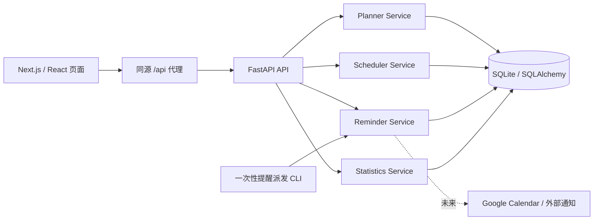

# 架构与服务边界

## 总体结构

前端负责呈现、表单、交互及 FullCalendar 拖动。后端负责验证、关联约束、重复生成、状态转换、时区解释、统计和提醒。前端不能绕过后端直接写数据库，也不持有业务数据的唯一副本。

## 后端职责

| 边界 | 负责内容 |
| --- | --- |
| API 层 | 请求验证、HTTP 错误、资源路由、数据库会话 |
| Planner | 用户驱动的任务创建/更新/完成/重新打开/延期/取消；操作历史；依赖检查；版本冲突 |
| Scheduler | 按日期窗口生成 Routine 实例；幂等性；实例序号；依赖 Routine 的原始日期匹配；规则变化处理 |
| Reminder | 计算派发时刻、持久化提醒工作、失效旧版本提醒、幂等派发通知；一次性 CLI 入口 |
| Statistics | 今日/本周计数、范围完成率、计划与实际时长、目标/项目/里程碑进度、项目分布 |
| Calendar | 任务与日历事件同步；独立事件；日/周/月查询；事件结束日期按 FullCalendar 约定不包含当天 |
| 持久化 | SQLAlchemy 模型、Alembic 迁移、SQLite 外键与 WAL |

## 重复任务和依赖

Routine 描述生成规则，Task 表示具体一次执行。`(routine_id, occurrence_date)` 唯一约束保证多次同步不会重复生成。

默认生成到今天之后 30 天。Routine 的 `materialized_through` 记录连续处理到的日期，停机后从此日期继续补齐，不用修改后的规则重算旧日期。显式生成窗口最多含 367 天；日历可查询任意远期日期，并按查询区间生成。若只查看一个远期窗口而中间日期尚未处理，此次生成不推进连续水位，避免下次漏掉中间任务。

`occurrence_date` 表示规则原始日期，延期只修改 `date`，因此前后序引用不会因用户改期漂移。`sequence_number` 用于给连续课程等用户自建系列提供稳定的实例序号；没有任何课程名称硬编码。

Routine B 依赖 A 且 `offset_days=1` 时，B 原始日期 D 对应 A 原始日期 D−1。依赖指向实际生成的 Task，并保留 Routine 关联以便解析。前序不存在或尚未完成时，界面显示依赖状态；第一版不会自动压缩、顺延或重新规划整个依赖链。Routine 规则图和实际 Task 图分别检查循环，包括规则编辑、生成实例和后补依赖时，避免手动依赖与规则依赖结合后形成环。

修改规则只影响未来且未经手动改动的实例；已完成、人工取消、已删除或手动改期等实例保留。用户修改单次任务时标记例外，不改写整个系列。暂停规则后，尚未人工处理的未来实例会取消；恢复后仅可恢复仍在未来的匹配实例，过去已取消的实例保持取消，暂停期间尚未生成的日期直接跳过，不形成历史欠账。

## 一致性与时间

- SQLite 启用外键、WAL 和 busy timeout，适合本机单用户负载。
- Task / Routine 用 `version` 做乐观并发控制；过期版本更新返回冲突，界面需要刷新，不静默覆盖另一页的修改。
- `created_at`、`updated_at`、`completed_at`、提醒派发时间等用 UTC ISO 时间；任务日期和时段使用用户设置时区。
- Task 截止时间输入必须带时区；Task 日程和独立 Calendar Event 使用设置时区下的本地时间，全天事件仅使用日期。单次 Task 不跨午夜，自动计算结束时间时也执行此约束。
- 状态变更保留 TaskHistory；删除任务使用软删除，防止重复规则重建已删除事项。
- DailyReview 保存时记录任务快照，之后改任务不会篡改当时的回顾记录。

## 提醒运行方式

提醒计划是数据库记录，不依赖某个浏览器定时器存活。网页在线时触发派发并读取通知；可选由 Windows 任务计划程序运行一次性 CLI 做站内通知落库。二者使用同一 Reminder Service，派发具幂等约束。

同一 Task 的相同 `due_at` 已派发后，仅修改标题或说明不会重复提醒。更改计划时间或提醒偏移后，按新的到期时间建立提醒；旧任务版本的待派发工作失效。

此设计没有永久运行的 `while True` Python 核心循环。服务停止、电脑休眠或浏览器关闭时不承诺准时系统通知。未来接入 Google Calendar 时实现 provider 适配、OAuth 与外部事件映射；第一版能力接口明确返回未连接状态。

## 扩展边界

AI Planner / Replanner 将作为独立建议生成服务，通过已有任务 API 应用用户接受的结果。Weekly Review、考试/求职/学业模块可关联现有 Goal / Project / Milestone / Task，不改写基础调度。外部日历利用 `provider` 与 `external_id` 关联；实际 OAuth、同步冲突与推送凭证不进入第一阶段。

## 本地部署

生产 Next.js 监听 `127.0.0.1:3000`，Uvicorn 监听 `127.0.0.1:8000`。Windows 脚本负责安装、迁移、构建、后台启动、健康检查、按身份停止与在线备份。应用没有认证；仅为本机单用户运行设计，公开部署需要另行完成安全与运维工作。
