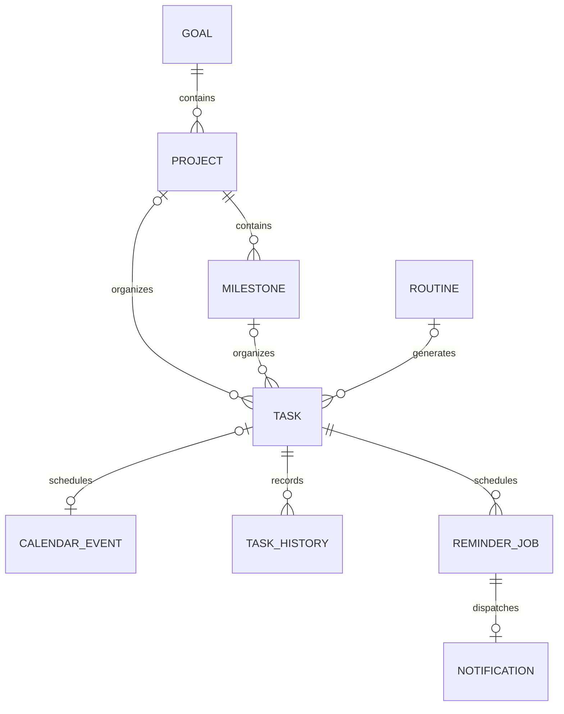

# 数据库结构

SQLite 默认文件：`data/planner.db`。SQLAlchemy 模型是字段实现依据，Alembic 管理版本；不要手工修改已应用迁移。

## 关系

除 `settings` 外，表都有 UUID 文本主键 `id` 及 UTC ISO 文本 `created_at` / `updated_at`。日期为 `YYYY-MM-DD`，日内时间为 `HH:MM`，时长单位为分钟。

## 组织结构

| 表 | 核心字段 |
| --- | --- |
| goals | name、description、start_date?、target_date?、status、priority、color |
| projects | name、goal_id?、start_date?、end_date?、status、description |
| milestones | name、project_id、start_date?、deadline?、status、description |

`?` 表示可为空。组织状态为 `active / paused / completed / archived`。Goal 颜色为 `#RRGGBB`；优先级 `1–3`。Milestone 必须属于 Project，Project 可以暂不关联 Goal。上层删除使用 RESTRICT，避免级联删除用户规划。

## tasks

| 字段 | 类型与含义 |
| --- | --- |
| title / description | 标题与说明 |
| project_id? / milestone_id? | 项目、阶段外键；同时存在时归属须一致 |
| date? / start_time? / end_time? | 用户时区中的计划日期与时段 |
| deadline? | UTC ISO 截止瞬间 |
| estimated_duration | 预计分钟数，0–1440 |
| priority | 1 高、2 中、3 低 |
| status | pending / completed / overdue / rescheduled / cancelled |
| completed_at? | 实际标记完成的 UTC 时间 |
| source | manual / routine 等来源标识 |
| routine_id? | 生成它的 Routine |
| occurrence_date? | 原始规则日期；用户延期时不变 |
| sequence_number? | 重复系列的实例序号 |
| depends_on_task_id? | 前序 Task 外键 |
| depends_on_routine_id? / offset_days | 前序 Routine 和原始日期向前偏移天数 |
| reminder? | 提前分钟数：0 / 10 / 30 / 60 / 1440；空为关闭 |
| is_exception | 此实例是否经过单次人工改动 |
| deleted_at? | 软删除时间，保留重复规则的去重依据 |
| version | 乐观锁版本 |

`(routine_id, occurrence_date)` 唯一。`date`、`deadline`、`status`、`completed_at`、`project_id` 建索引。优先级、时长和状态有数据库检查约束。Task 依赖使用 RESTRICT，业务层拒绝自依赖与循环依赖。

## routines

字段：`name`、`description`、`project_id?`、`milestone_id?`、`frequency`、`interval`、`interval_unit`、`weekdays`、`start_date`、`end_date?`、`preferred_time?`、`estimated_duration`、`priority`、`reminder?`、`active`、`depends_on_routine_id?`、`offset_days`、`version`、`deleted_at?`、`materialized_through?`。

- `frequency`：daily / every_n_days / weekly / weekdays / custom。
- `interval >= 1`，自定义单位支持 days / weeks。
- `weekdays` 为 JSON 数组，0 是周一、6 是周日。
- `offset_days >= 0`；用原始发生日期关联前序实例。
- 关闭 `active` 停止继续生成，不删除完成历史；删除规则为软删除，不破坏已有任务引用。
- `materialized_through` 是可空的 `YYYY-MM-DD` 连续生成水位，由 Scheduler 维护，不是用户输入。停机补齐从水位之后开始；修改规则不重算已覆盖的历史日期。远期孤立窗口不推进此水位；恢复暂停规则时跳过暂停期间尚未生成的日期。
- Routine 与 Task 两层依赖图分别防环；不能仅凭 Routine 图无环推断实际任务图无环。

## 日历与审计

| 表 | 核心字段与约束 |
| --- | --- |
| calendar_events | task_id?（唯一）、title、start、end、all_day、color、description、provider、external_id?；区间索引 start/end |
| task_history | task_id、action、before JSON、after JSON；记录操作前后快照 |

Task 可有一个对应的 Calendar Event；不关联 Task 的事件是独立日历事项。Task 日程和独立事件均按设置时区的本地时间解释，单次 Task 不跨午夜。`end` 是排除上界，全天 9 月 20 日的事件结束日期为 9 月 21 日。第一版 provider 为 local。

## 提醒

| 表 | 核心字段与约束 |
| --- | --- |
| reminder_jobs | task_id、due_at UTC、task_version、status、channel；`(task_id, task_version)` 唯一 |
| notifications | job_id（唯一）、task_id、title、due_at UTC、read_at? |

任务变更后使用新版本提醒，旧待派发计划失效；一个提醒工作最多生成一条通知，避免刷新或重复 CLI 调用造成多条提醒。若同一任务的相同 `due_at` 已经 delivered，仅编辑标题/说明不再生成新提醒，避免版本递增导致重复通知。

## 回顾与设置

`daily_reviews`：`date` 唯一，`actual_minutes`、`energy_level`、`notes`、`project_minutes JSON`、`completed_tasks JSON`、`unfinished_tasks JSON`。项目分配分钟不得为负，合计不得超过当天实际分钟；剩余视作未分配时间。任务列表在保存时形成快照。

`settings`：单行 `id=1`，`timezone` 默认为 `Asia/Shanghai`，`day_start` 默认为 `09:00`。

## AI 聊天（迁移 0002 / 0003）

| 表 | 字段与约束 |
| --- | --- |
| conversations | id、title、created_at、updated_at |
| chat_messages | id、conversation_id（CASCADE）、position、role、content、status、model、duration_ms、error、created_at、updated_at；会话内 position 唯一 |
| ai_settings | 单行 id=1，model、num_ctx、temperature、think；不含凭证 |

role 支持 system/user/assistant/tool，但系统提示不写入聊天表。status 支持 generating/completed/stopped/error。position 保证时间戳相同时消息顺序稳定。与规划表无外键，不允许模型直接查询或修改业务数据。

## Agent 操作（迁移 0004）

| 表 | 字段与约束 |
| --- | --- |
| agent_action_logs | conversation_id、tool_name、tool_arguments JSON、permission_level、status、before_state / after_state JSON、affected_entities JSON、error_message、undone_at、created_at |
| pending_agent_actions | conversation_id、tool_name、tool_arguments JSON、description、affected_count、status、resolved_at、created_at |

每次 WRITE / DESTRUCTIVE Tool 都记录成功、拒绝或错误。待确认动作保存精确参数，确认接口只执行该记录。Undo 使用 before_state 恢复，并以 undone_at 防止重复撤销。

## 备份方式

启用 WAL 时不要直接复制运行中的主数据库文件。`backup.ps1` 使用 Python 标准库 `sqlite3.Connection.backup()` 得到一致性副本，并执行 `PRAGMA integrity_check`。JSON 导出用于查看与迁移参考；完整恢复以 SQLite 备份为准，第一版没有自动 JSON 导入。
