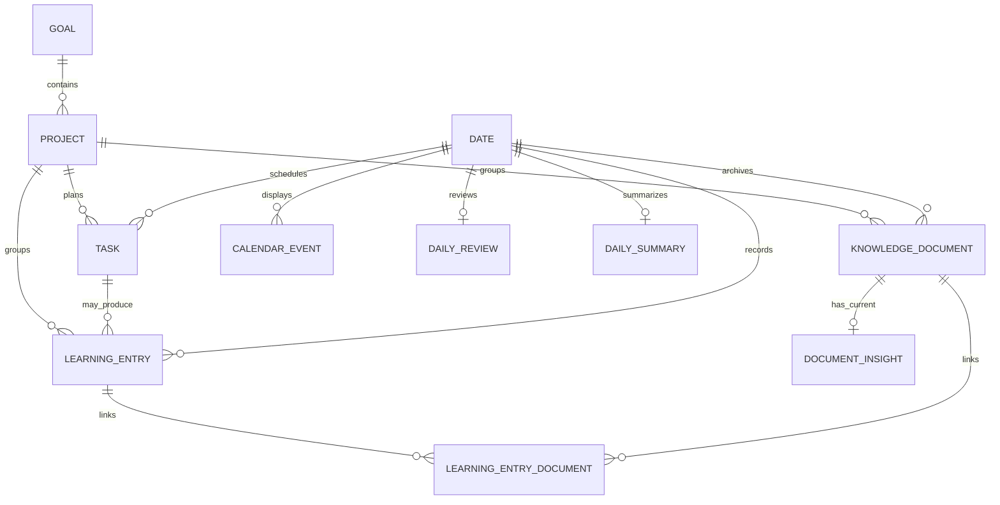

# Personal Learning Archive + Knowledge Base 设计

状态：架构已确认；Phase 1 已实现 LearningEntry、KnowledgeDocument、长期文件存储、基础文本解析、关联关系及两个主导航页面。Day Detail、任务完成联动、AI 分析、FTS 与 RAG 留待后续阶段。

## 1. 当前项目审计

DayMark 当前是本机单用户系统：Next.js 前端经同源 `/api` 代理访问 FastAPI；SQLAlchemy + SQLite 开启外键、WAL 与 busy timeout；Schema 通过 Alembic `0001`–`0006` 演进。业务数据链为 Goal → Project → Milestone → Task，Routine 物化 Task，Planner 同步 Task 与唯一 CalendarEvent。DailyReview 保存人工实际时长、能量、笔记和当日任务快照。

AI 只有一套 Agent Loop、Tool Registry 与 Tool Executor。Provider Router 在 DeepSeek Cloud 与本地 Qwen 间选择，工具最终调用现有 Service，写操作具 request_id、指纹幂等、Action Log 与确认边界。新模块必须扩展这条工具链，不能建立第二套 Agent。

现有 `ChatAttachment` 只适合聊天上下文：它与 Conversation/ChatMessage 绑定并随对话删除；原文件位于 `data/uploads`；单文件 10 MB；解析文本截断为 9000 字。其 PDF/DOCX/文本解析代码可拆出复用，但表、生命周期和截断策略不能复用为长期知识库。

现有 Calendar 是日期范围视图，不是数据仓库。它返回 Task 同步事件和独立 CalendarEvent；当前 Schema 没有 `ClassEvent` 或可靠的“课程”分类。第一版 Day Detail 应显示 `Events / Tasks`，课程标题可照常出现；若未来必须严格区分课程，再给 Routine/Event 增加显式 kind，不能靠标题猜测。

前端主体仍是一个 hash 驱动的工作区，`/assistant` 是独立入口但复用主体组件。新页面应先复用现有外壳、API client、Toast、Project 数据和刷新机制，避免同时进行全站路由重构。

## 2. 产品信息架构

五个概念保持单一语义：

| 概念 | 回答的问题 | 是否计划数据 | 是否事实记录 |
| --- | --- | --- | --- |
| Task | 我要做什么？ | 是 | 否 |
| LearningEntry | 我实际做了什么？ | 否 | 是 |
| KnowledgeDocument | 我留下了什么？ | 否 | 是 |
| DocumentInsight | 从资料中提炼出了什么？ | 否 | AI 派生结果 |
| DailySummary | 这一天整体获得了什么？ | 否 | 人工或 AI 聚合快照 |

主导航增加两个入口：

- **Learning Archive**：Timeline、Daily Learning、Project 筛选、最近记录、最近产出。
- **Knowledge Base**：文件中心、搜索、Project/日期/类型筛选、文档详情与显式 AI Analyze。

Calendar 继续是日期视图；点击日期打开 Day Detail。Daily Review 继续是每天收尾的统一入口，在同一页面加入 Learning Entries、Documents、Outputs 和 Generate Summary，不再另建一个与它重复的 Daily Learning 日页。

Project 详情以后增加 Learning、Documents、Outputs、Insights 四个区块，但 Project 仍是唯一长期分类，不新增知识库 Category。

## 3. 数据关系



`Task → LearningEntry` 是一对多：一次计划可能分多次完成。`LearningEntry ↔ KnowledgeDocument` 使用关联表而非 `learning_entry_id` 单外键，使同一资料能关联多个学习记录，也满足重复文件只存一份的要求。

`knowledge_date` 是文档的主要归档日期；`upload_date` 是文件进入系统的时间。日历、Archive 和统计按 `knowledge_date`，文件中心可额外按 `upload_date` 排序。

## 4. 数据模型

### LearningEntry

| 字段 | 类型/约束 | 说明 |
| --- | --- | --- |
| id | UUID PK | 稳定标识 |
| date | `YYYY-MM-DD`, indexed | 实际发生日期 |
| project_id | FK Project nullable, indexed, RESTRICT | 沿用现有 Project |
| task_id | FK Task nullable, indexed, SET NULL | 可从 Task 产生，也可独立创建 |
| title | varchar(200) | 本次实际活动 |
| entry_type | checked string | study/assignment/project/output/reading/research/internship/exam/reflection/other |
| description | text | 做了什么 |
| duration_minutes | int >= 0 | 实际投入 |
| progress | int 0–100 nullable | 本次完成度 |
| status | checked string | in_progress/completed/partial/abandoned |
| reflection | text | 收获与反思 |
| problems | text | 未解决问题 |
| next_action | text | 下一步 |
| tags | JSON array | 用户确认或编辑的标签 |
| concepts | JSON array | 用户确认或编辑的概念 |
| version | int | 乐观并发 |
| deleted_at | UTC ISO nullable | 软删除 |
| created_at / updated_at | UTC ISO | 审计字段 |

索引：`date`、`project_id`、`task_id`、`entry_type`、`status`、`(project_id,date)`。不为 `task_id` 建唯一约束。

Task 增加 `track_learning BOOLEAN NOT NULL DEFAULT false`。完成该 Task 后前端显示“记录本次学习？”；后端不自动创建 LearningEntry。以后可增加用户级自动创建偏好，但不能用标题或 Project 名猜测。

### KnowledgeDocument

| 字段 | 类型/约束 | 说明 |
| --- | --- | --- |
| id | UUID PK | 文档标识 |
| title | varchar(200) | 用户可编辑标题 |
| source_type | file/text | 原文件或直接文本 |
| original_filename | varchar(255) nullable | 保留上传名，不参与路径 |
| storage_path | text nullable | 相对 `data/knowledge` 的路径 |
| file_type | varchar(30) | 规范化扩展名/解析类型 |
| mime_type | varchar(200) | 服务端检测/声明值 |
| file_size | bigint | 原文件字节数 |
| sha256 | char(64) unique indexed | 去重与完整性校验 |
| project_id | FK Project nullable, indexed, RESTRICT | 主 Project |
| knowledge_date | date indexed | 资料归属日期 |
| upload_date | date indexed | 上传日期 |
| document_type | checked string indexed | note/slides/assignment/solution/code/paper/output/reflection/reference/exam/other |
| is_output | bool indexed | 独立标记产出；不与文档类型互斥 |
| processing_status | checked string | stored/parsing/ready/failed |
| parser_name / parser_version | string nullable | 提取来源，供重建索引 |
| extracted_text | text | 本地解析后的规范化文本 |
| extracted_at | UTC ISO nullable | 最近解析时间 |
| extraction_error | text nullable | 安全错误，不存堆栈 |
| description | text | 人工说明，不与 AI summary 混用 |
| version / deleted_at | int / UTC ISO | 并发与软删除 |
| created_at / updated_at | UTC ISO | 审计字段 |

`summary` 不放在 KnowledgeDocument，避免和 DocumentInsight 出现两个 AI 摘要真相。文档可以没有文件（`source_type=text`），此时 `extracted_text` 保存用户正文，`storage_path` 为空。

### LearningEntryDocument

复合唯一键 `(learning_entry_id, document_id)`；另有 `relationship`（evidence/output/reference）和 `created_at`。两个外键均 RESTRICT/级联删除关联行，不级联删除实体。

### DocumentInsight

| 字段 | 类型/约束 |
| --- | --- |
| id | UUID PK |
| document_id | FK unique indexed |
| summary | text |
| key_takeaways / concepts / open_questions / skills / outputs / suggested_tags | JSON arrays |
| source_fingerprint | char(64) |
| provider / model / prompt_version | string |
| generated_at / updated_at | UTC ISO |

第一版保留一个“当前 Insight”，Regenerate 原位更新并记录模型、prompt version 和源文本指纹。原文件与 extracted_text 足以重新生成，因此暂不保存每次 AI 版本；如未来需要学术审计，再引入 append-only `DocumentInsightRevision`，无需改变 Document/Chunk 主键。

### DailySummary

| 字段 | 类型/约束 |
| --- | --- |
| id | UUID PK |
| date | date unique indexed |
| summary / learning_summary | text |
| completed_items / key_takeaways / open_questions / outputs / next_actions | JSON arrays |
| time_summary | JSON object | 总时间与 Project 分布快照 |
| source_fingerprint | char(64) | 当日结构化输入指纹 |
| generation_type | manual/ai |
| provider / model / prompt_version | nullable string |
| generated_at / updated_at | UTC ISO |

DailySummary 是可重建的当日快照，第一版同样只保留当前版本。Regenerate 覆盖当前内容；用户手工编辑后必须明确确认覆盖。

## 5. File Storage

原文件存储于 `data/knowledge/aa/<document_uuid>.<safe_extension>`，其中 `aa` 为 SHA256 前两位。数据库只保存相对路径。原始文件名只作为元数据和下载响应名，绝不拼接进磁盘路径。

上传流程：流式写临时文件 → 同时计算 SHA256 与大小 → 检查扩展名/MIME/上限 → 查询重复哈希 → 原子移动到最终路径 → 同一事务创建 Document。数据库失败时删除新文件；文件移动失败时不提交数据库。

SHA256 全局唯一。重复上传时返回 `409 DUPLICATE_DOCUMENT` 和已有文档的安全元数据；UI 提供“关联已有文档”而非再存二进制。软删除后文件先保留，人工执行垃圾回收时仅删除没有任何有效关联且超过保留期的文件。第一版不做自动垃圾回收。

下载接口根据 UUID 查库、解析受控根目录下的路径，并再次校验 resolved path 位于 `data/knowledge`，防止路径遍历。上传上限由配置控制，MVP 建议 25 MB。

## 6. Parsing 架构

```text
DocumentIngestService
  → FileTypeDetector
  → DocumentParserRegistry
      ├─ TextParser / MarkdownParser / CodeParser
      ├─ PDFParser
      ├─ DOCXParser
      ├─ PPTXParser (later)
      ├─ SpreadsheetParser (later)
      └─ ImageParser/OCR (future)
  → TextNormalizer
  → KnowledgeDocument.extracted_text + parser provenance
```

统一接口：`supports(metadata)`, `extract(path) -> ParsedDocument(text, metadata, warnings)`。Parser 不访问数据库、不调用 AI。Ingest Service 负责状态转换和事务。

Phase 1 只支持现有可靠的文本、Markdown、常见代码、PDF、DOCX；将 `attachments.py` 的解析逻辑拆成共享 parser，不复制。PPTX/XLSX/图片只在注册表留下可扩展边界，不立刻安装依赖。知识库 MVP 不开启新的 OCR pipeline；现有聊天 PDF OCR 能力可在后续作为可选 Parser 接入。

长文本不能沿用聊天附件 9000 字截断。数据库保存完整规范化 extracted_text，并设置合理文件/字符上限；给模型时由 DocumentAnalysisService 分段。

## 7. Document Analysis 与隐私

上传、存储、哈希、解析默认全部本地完成。只有用户点击 **Analyze with AI**、**Generate Daily Summary**，或明确向 Assistant 提问知识内容时，才允许调用所选 Provider。

DocumentAnalysisService 接收 Document ID，读取 extracted_text，按字符/token 预算分段，生成局部结构，再聚合为一个 DocumentInsight。它只向模型发送必要文本、文档标题、Project 名和知识日期；不发送 API Key、磁盘路径、完整数据库或无关文档。

Local Qwen 模式不出机；DeepSeek/Auto 使用云端时 UI 明示“将发送选中文档的必要文本片段”。Action Log 记录工具、document_id、provider、model、请求 ID和状态，但不记录原文或 Key。

## 8. Knowledge Search

`KnowledgeSearchService` 是唯一检索入口：

1. 先解析显式日期、日期范围、Project、document_type、entry_type。
2. 用索引做 Structured Search。
3. 无法由结构化字段回答时使用 SQLite FTS5。
4. 只有未来语义问题才调用 Semantic Retriever。

Phase 1–4 用结构化 SQL 和小范围 `LIKE`；Phase 5 创建 FTS5 索引，覆盖 LearningEntry 的 title/description/reflection/problems/tags/concepts，KnowledgeDocument 的 title/description/extracted_text，以及 DocumentInsight 的 summary/takeaways/open_questions/concepts。FTS 结果始终再套 Project/日期/删除状态过滤。

未来 RAG 接口：

```text
KnowledgeSearchService
  ├─ StructuredRetriever
  ├─ FullTextRetriever
  └─ SemanticRetriever (future)
       → EmbeddingProvider (independent from LLMProvider)
```

`DocumentChunk` 未来字段：document_id、chunk_index、content、token_count、source_fingerprint、embedding_reference、embedding_model、created_at，唯一 `(document_id, source_fingerprint, chunk_index)`。现在不建 Chunk 表、不生成 embedding、不安装向量库。

## 9. Assistant Tools

所有工具加入现有 Registry/Executor/Action Log；模型不直接查 SQL。

READ：

- `get_learning_entries(date?, start_date?, end_date?, project_id?, entry_type?, status?)`
- `get_learning_entry(entry_id)`
- `get_documents(date?, project_id?, start_date?, end_date?, document_type?, is_output?)`
- `get_document(document_id, include_text=false)`；默认只返元数据和截断摘要
- `get_document_insight(document_id)`
- `get_day_detail(date)`；复用 DayAggregateService
- `get_daily_summary(date)`
- `search_learning_archive(query, project_id?, start_date?, end_date?)`

WRITE：

- `create_learning_entry`
- `update_learning_entry`
- `attach_document_to_learning_entry`
- `generate_document_insight`；必须是用户明确要求分析该文档
- `generate_daily_summary`；必须是用户明确要求生成/重新生成

第一版不向 Agent 注册 delete 工具。未来删除 LearningEntry/Document 属于 DESTRUCTIVE，必须保存 PendingAgentAction 并由用户确认。文件上传仍由用户界面完成；Agent 只能关联已经存在的 document_id，不能从模型侧伪造本机文件。

Agent 意图路由增加日期档案类 Tool 子集。`“9月22日我做了什么”` 首选 `get_day_detail`，而非让模型分别执行五次查询；`“RoPE 哪里没懂”` 使用 search，并优先 problems/open_questions/insight。

## 10. Calendar 与 Day Aggregate

新增只读 `DayAggregateService.get(date)`，一次用带索引查询返回：

```json
{
  "date": "2026-09-22",
  "events": [],
  "tasks": [],
  "learning_entries": [],
  "documents": [],
  "outputs": [],
  "daily_review": null,
  "daily_summary": null,
  "totals": {"learning_minutes": 0, "documents": 0, "outputs": 0}
}
```

API 为 `GET /api/days/{date}`。Calendar 点击日期只发这一项主请求并打开侧边 Day Detail。Calendar 表本身不新增 LearningEntry 事件，也不把文档伪装成 CalendarEvent；月格可显示数量徽标，详细数据来自聚合服务。

Day Detail 顺序：Events/Classes → Tasks → Learning → Documents/Outputs → Daily Review → Daily Summary。现阶段标题使用“Events / Classes”，严格课程分类留待显式 event kind 设计。

## 11. Daily Review 集成

保留现有 DailyReview 作为人工复盘：能量、自由笔记、任务快照和人工时长。LearningEntry 是结构化实际活动，DailySummary 是聚合输出。三者在一个 **Daily Review** 页面内呈现，而非三个重复页面。

时间来源必须明确：`sum(LearningEntry.duration_minutes)` 是“已记录学习时间”；`DailyReview.actual_minutes` 暂时仍是用户填写的“全天实际工作/学习时间”。页面同时显示并提示差值，不自动互相覆盖。后续若决定统一，再通过兼容迁移改成 `other_minutes` 或 override 字段，不能现在悄悄改变历史统计语义。

Generate Summary 输入 DayAggregate 中的结构化字段和现有 DocumentInsight；不默认读取原文件全文。没有 Insight 的文件只提供标题、类型和人工说明。

## 12. REST API

新模块使用独立 routers，避免继续扩大当前 `main.py`：

| 方法 | 路径 | 说明 |
| --- | --- | --- |
| GET/POST | `/api/learning-entries` | 过滤列表 / 创建 |
| GET/PATCH | `/api/learning-entries/{id}` | 详情 / 局部更新 |
| POST | `/api/learning-entries/{id}/documents/{document_id}` | 关联已有文档 |
| DELETE | `/api/learning-entries/{id}/documents/{document_id}` | 仅解除关联 |
| POST | `/api/documents` | multipart 元数据 + 文件上传 |
| GET | `/api/documents` | 日期、Project、类型、output 筛选 |
| GET/PATCH | `/api/documents/{id}` | 元数据详情 / 编辑归档字段 |
| GET | `/api/documents/{id}/download` | 下载原文件 |
| POST | `/api/documents/{id}/analyze` | 明确触发 AI 分析 |
| GET | `/api/documents/{id}/insight` | 当前 Insight |
| GET | `/api/days/{date}` | Calendar/Daily Review 聚合 |
| GET | `/api/daily-summaries/{date}` | 已保存 Summary |
| POST | `/api/daily-summaries/{date}/generate` | 首次生成 |
| POST | `/api/daily-summaries/{date}/regenerate` | 明确覆盖生成 |
| POST | `/api/knowledge/search` | 结构化 + 全文搜索 |

上传使用 multipart，而现有聊天附件继续保持原 API。PATCH 只接受白名单字段并带 version；列表使用 `limit/cursor`，不在数据增长后返回全表。

## 13. Frontend 页面

### Learning Archive

- 顶部：Today learning minutes、Entries、Documents、Outputs。
- Timeline：按日期分组的 Entry 卡片，显示 Project、类型、时长、进度、文档数。
- 筛选：日期范围、Project、Entry Type、Status。
- Quick Record：Project、标题、时长为主，Reflection/Problems/Files 可展开。

### Knowledge Base / File Center

- 搜索框与 Project、知识日期、文档类型、Output 筛选。
- 上传抽屉：File + Date + Project 是主字段；Title/Type/Entry Link 可选展开。
- 文档详情：元数据、关联 Entries、提取状态、文本预览、Insight、下载、显式 Analyze。
- 重复文件弹窗：显示已存在文档并提供“关联到当前 Entry”。

### Task 完成

Task 增加 `track_learning` 开关。完成后若为 true，弹出轻量表单，预填 date、project、task、title、estimated duration；用户补实际时间、反思、问题和文件。关闭弹窗不影响 Task 已完成状态。

### Project

先增加统计与链接：总学习时间、Entry/Document/Output/Open Question 数量；详细 Tabs 在后续 Phase 完成。MVP 不做课程树或 Knowledge Graph。

## 14. 权限

- READ：查看、搜索、聚合，自动执行。
- WRITE：创建/编辑 LearningEntry、关联文档、生成 Insight/Summary；复用 request_id、指纹幂等与 Action Log。
- DESTRUCTIVE：删除 Entry、删除 Document、批量操作；必须人工 UI 或 Agent confirmation。
- 原文件删除与数据库软删除分离。解除关联绝不删除原文件。
- 本机 mutation origin guard 继续生效；若未来允许局域网/公网访问，必须先增加认证与每用户数据隔离。

## 15. Migration

新增 `0007_learning_archive.py`，只执行：新增四张实体表和关联表、给 Task 增加 `track_learning` 默认 false、创建索引与 CHECK/FK。使用 SQLite batch migration；不 drop、rename 或重写现有 Task/Calendar/DailyReview 数据。

部署顺序：备份 planner.db → 在临时数据库执行 `upgrade 0006 → head` → `alembic check` → 验证历史行数/外键 → 在真实数据库 upgrade。Downgrade 只删除新表/新列，且文档原文件需单独保留，不由 downgrade 删除。

FTS5 放在独立的后续 migration，不和核心表同时上线，便于在不支持 FTS5 的环境中诊断与回滚。

## 16. 开发阶段与验收

### Phase 1：事实记录与文件基础

实现 Schema、Learning CRUD、KnowledgeDocument 上传/下载/去重、文本类基础解析、Learning Archive/File Center 基础页。

验收：可手工记录一次学习；上传文件后原文件与元数据长期存在；按 date/project 查询；重复文件不产生第二份二进制；旧 Task/Calendar/聊天不回归。

### Phase 2：日期与任务闭环

实现 DayAggregate、Calendar Day Detail、`track_learning`、Task 完成后的可选 Quick Record、Daily Review 合并展示。

验收：完成学习 Task 后可选建 Entry；不学习的 Task 不弹；Calendar 一次请求显示当天任务、Entry、文档与产出；取消记录不影响 Task。

### Phase 3：解析与 DocumentInsight

抽出 Parser Registry，完善 PDF/DOCX/PPTX/XLSX 支持；实现显式 DeepSeek Analyze、分段分析和当前 Insight。

验收：解析失败保留原文件并显示 failed；长文档不一次整篇发云端；用户未触发时无云端文档请求；Insight 可重新生成。

### Phase 4：Daily Summary 与 Agent Tools

实现 DailySummary、结构化日总结、Learning/Knowledge READ 与安全 WRITE tools。

验收：Assistant 能回答指定日做了什么/学了什么；能按 Project + 日期范围总结；生成结果持久化；查询不会重复生成；写工具具幂等日志；无删除工具。

### Phase 5：SQLite FTS5

建立 FTS 索引、同步触发器或显式索引服务、搜索排序与高亮。

验收：RoPE 可命中 problems/open_questions/notes；编辑和软删除后索引一致；日期/Project 过滤先于结果返回；数千文档搜索无需全表 Python 扫描。

### Phase 6：Embedding / RAG

实现 DocumentChunk、EmbeddingProvider、SemanticRetriever 与混合排序。

验收：仅语义型查询进入向量检索；结构化日期问题仍走 SQL；embedding 与 DeepSeek Provider 解耦；文档更新可根据 source_fingerprint 增量重建。

## 17. 现在必须为未来 RAG 保留的设计

必须现在确定：稳定 Document UUID；不可变原文件与 SHA256；完整 extracted_text；parser/version/source fingerprint；Project 与 knowledge_date 索引；Document 与 Entry 多对多；Insight 独立于原文；软删除；检索统一入口；EmbeddingProvider 与 LLMProvider 解耦；AI 发送文本的显式隐私边界。

这些决定若以后再补，会导致重新命名文件、重连文档、重建历史归档或无法判断哪些 chunk 已过期。

## 18. 现在不应该做

不建 Knowledge Graph、Tag/Concept 实体图、向量数据库、Embedding pipeline、多 Agent、云端对象存储、自动互联网抓取、复杂文档版本树、常驻后台 worker、全自动分类、自动把所有文档发送 DeepSeek、基于标题猜测课程/学习任务。

## 19. 风险

- SQLite 大文本和未来几十万 chunk 会增大备份与 FTS 维护成本；MVP 可接受，向量索引应独立存储引用。
- 文件写入与 SQLite 事务无法形成真正分布式原子事务，需要临时文件、补偿删除和孤儿扫描。
- PDF/PPTX 表格与多栏布局提取质量不稳定；必须保留原文件、parser provenance 和重新解析能力。
- DeepSeek 分析会产生费用并传输片段；必须逐文档显式触发并显示 Provider。
- DailyReview 人工总时长与 Entry 时长可能不一致，UI 必须并列展示，不能静默覆盖。
- 当前没有 ClassEvent 类型，若强行分类会产生错误；严格课程分类需要后续显式字段。
- 当前单机无认证。知识文件比任务更敏感，不能在补认证前公开监听地址。

## 20. 需要确认的产品决定

推荐默认方案如下，确认架构时可逐项调整：

1. **Task 一对多 LearningEntry**：允许一个任务分多次实际学习。
2. **Document 多对多 Entry**：同一文件只存一次，可关联多次学习。
3. **`is_output` 独立字段**：文档类型和“是否成果”不是同一维度。
4. **Project 可为空**：临时阅读可先记录，之后再归类。
5. **DailyReview 不删除**：保留能量/人工复盘；Entry 时长与人工总时长并列。
6. **AI 分析默认关闭**：上传只做本地解析，逐文档明确触发云端分析。
7. **Insight/Summary 第一版只留当前版本**：保留生成元数据和源指纹，不做复杂版本历史。
8. **文档软删除后保留文件**：第一版不自动清理，后续增加可预览的垃圾回收。
9. **课程暂不另建 ClassEvent**：Day Detail 先展示 Events / Classes；严格分类以后加显式 kind。
10. **前端先融入现有工作区**：先增加 Learning/Knowledge 导航与组件，避免 Phase 1 同时重构全站路由。
